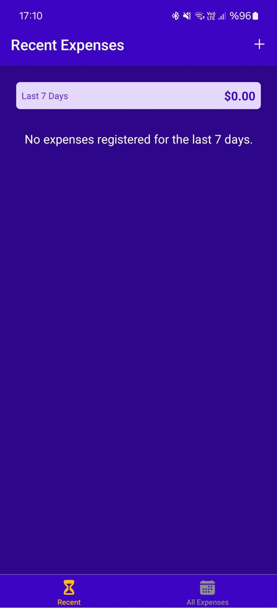
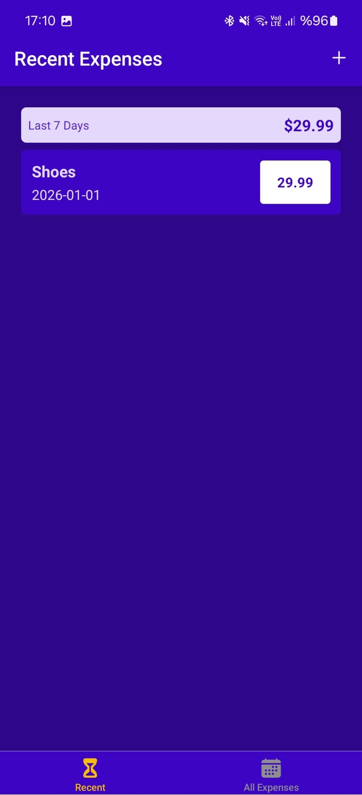
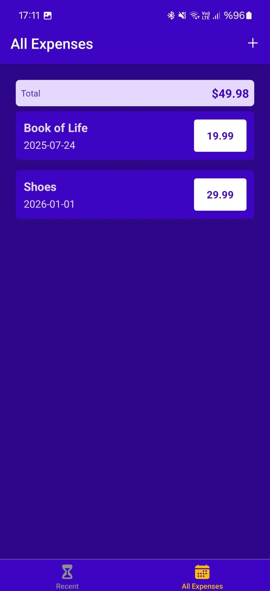
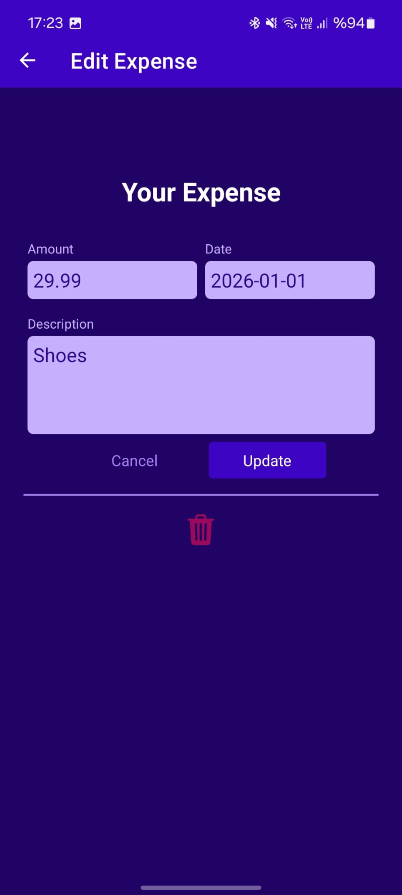

# 💰 Expense Tracker App

A multi-screen mobile application built with **React Native** that allows users to track their expenses, manage budgets, and view spending history. This project demonstrates advanced navigation patterns, **Firebase** for Realtime Database, **Axios** for Http Requests and **Context API** for global state management, with HTTP integration for data persistence.

## 🌟 Features

1. **Navigation Flow:** Seamless transition between expense views using **Bottom Tab Navigation** and **Stack Navigation** for modals.
2. **Expense Management:** Add, edit, and delete expenses with a user-friendly form interface.
3. **Http Requests & Backend:** Uses **axios** for handling http requests and **Firebase** for realtime database.
4. **Data Persistence:** Expenses are stored and retrieved using HTTP requests for real-time synchronization.
5. **Dynamic Filtering:** View recent expenses (last 7 days) or all expenses with automatic categorization.
6. **Responsive UI:** Clean, intuitive design with proper safe area handling for modern devices.

## 📸 Screenshots

<div style="display: flex; flex-wrap: wrap; justify-content: center; gap: 10px;">
  
  
  
  
  
</div>

## 🛠 Tech Stack

- **React Native**
- **Expo**
- **React Navigation** (Native Stack & Bottom Tabs)
- **Context API** (State Management with useReducer)
- **Axios** (HTTP Client)
- **Firebase** (Backend & Realtime Database)
- **Javascript (ES6+)**

## 🚀 Installation

To run this project locally, follow these steps:

1. **Clone the repo**

2. **Create an .env file and store your database URL**
3. **Install dependencies:**

   ```bash
   npm install
   ```

4. **Run the app:**
   ```bash
   npx expo start
   ```

## 📂 Project Structure

- `App.js`: Main entry point setting up Navigation and State Providers.
- `screens/`: Contains AllExpenses, ManageExpense, and RecentExpenses screens.
- `components/`: Reusable UI components including ExpenseForm, ExpensesOutput, and various UI elements.
- `store/`: Context API implementation for expense state management.
- `util/`: Utility functions for date handling and HTTP requests.
- `constants/`: Global styles and constants.

---

_Developed to master React Native navigation, http request handling and state management patterns._
