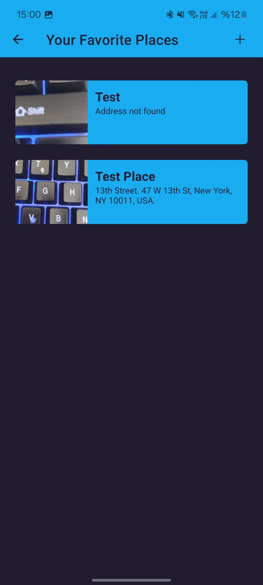
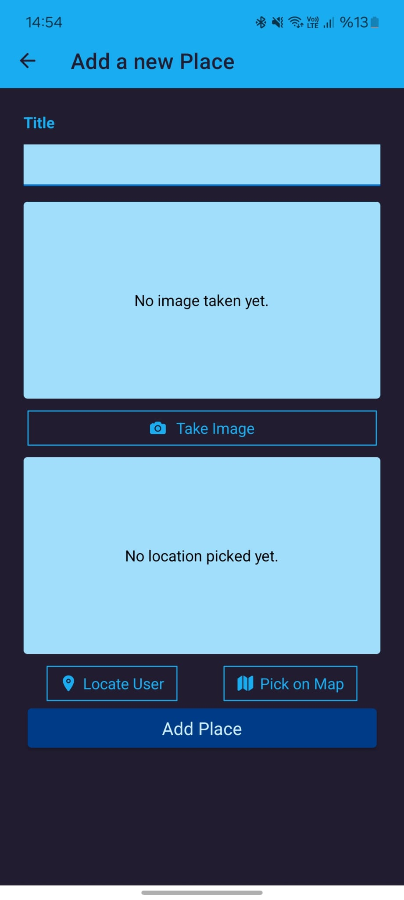
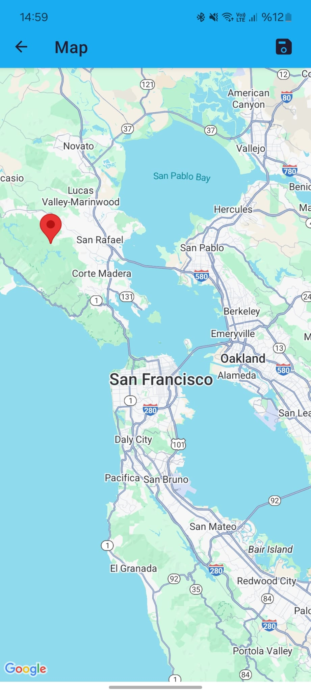
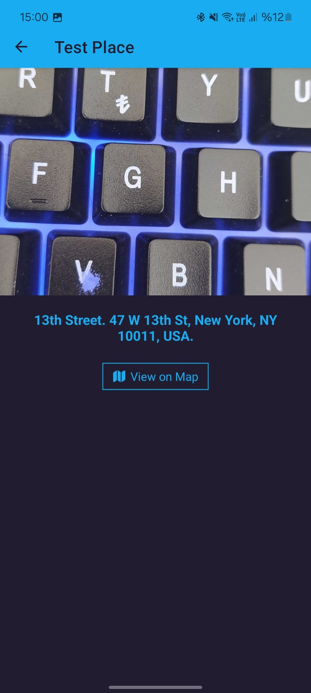

# 📍 Favorite Places

This project is a functional demo application built with **React Native** and **Expo**. It allows users to create a collection of their favorite spots by documenting the location name, capturing a photo, and pinning the exact location on a map.

The primary focus of this project is the integration of **Native Device Features** (Camera, GPS, Maps) and persistent local storage using **SQLite**, rather than complex UI design or extensive error handling.

## 🌟 Key Features

1. **Native Camera Integration:** Users can access the device camera to take photos of their favorite places directly within the app.
2. **Location Services:** Uses **Expo Location** to fetch the user's current coordinates automatically.
3. **Interactive Maps:** Integration with **Google Maps** (via `react-native-maps`) allows users to manually pick a location on the map.
4. **Local Data Persistence:** All data (Title, Image URI, Coordinates, Address) is stored locally on the device using **Expo SQLite**, ensuring data remains available across app restarts.
5. **Dynamic List View:** Displays a list of all added places with their details.

## 📸 Screenshots

<div style="display: flex; flex-wrap: wrap; justify-content: center; gap: 10px;">
  
  
  
  
</div>

## 🛠 Tech Stack

- **Core:** React Native, Expo
- **Navigation:** React Navigation (Native Stack)
- **Native Features:**
  - `expo-camera` (Image Capture)
  - `expo-location` (Geolocation)
  - `react-native-maps` (Map Interface)
- **Storage:** `expo-sqlite` (Local Database)
- **Networking:** Google Maps Geocoding API (for address conversion)

## ⚠️ Disclaimer

This is a **demo application** created for educational purposes. The main objective was to practice implementing native device features and local database management. As such, the UI/UX is minimal, and edge-case error handling is limited.

## 🚀 Installation

To run this project locally:

1. **Clone the repository**
2. **Install dependencies:**
   ```bash
   npm install
   ```
3. **Configure API Keys:**
   - You will need a valid **Google Maps API Key** for the map and geocoding features to work on Android/iOS.
   - Add your API key to your `app.json` or configuration file.
4. **Run the app:**
   ```bash
   npx expo start
   ```
