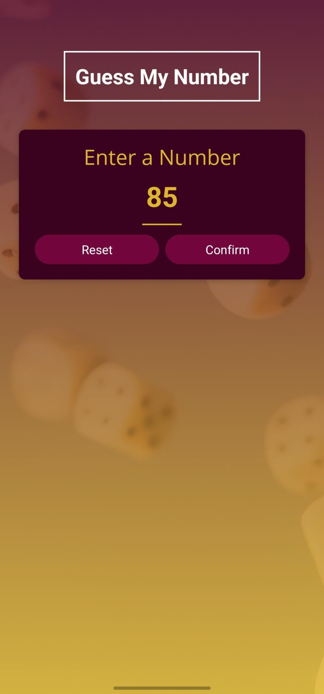
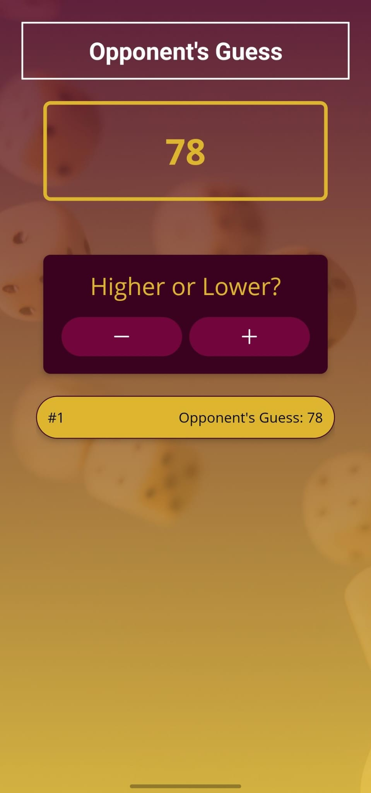
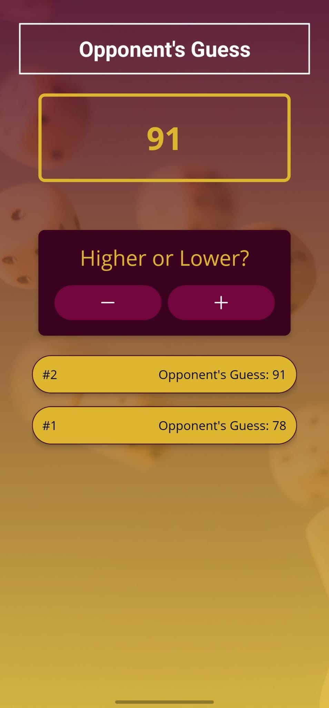
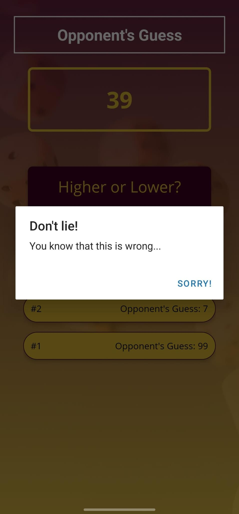
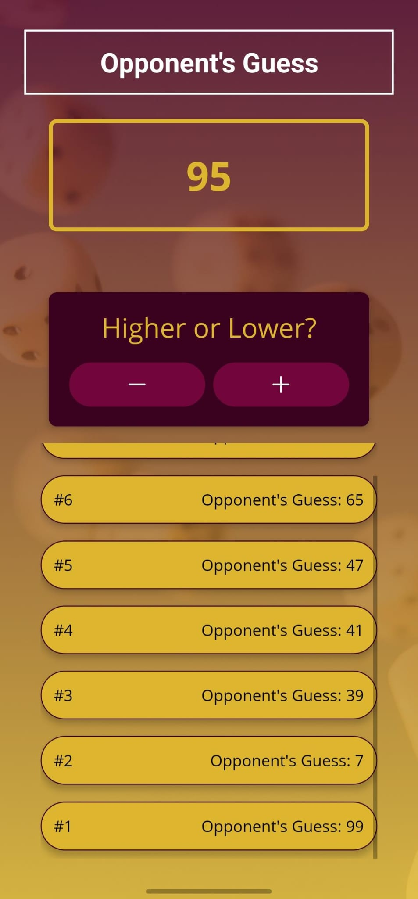
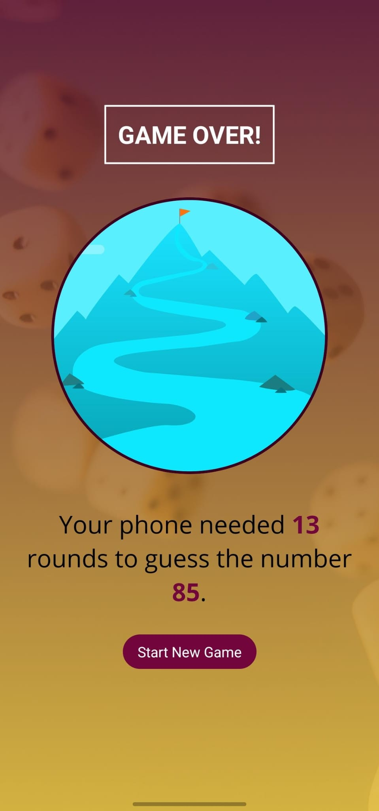

# 📱 Guess My Number

A simple mobile game built with **React Native** where the user picks a number and the phone tries to guess it. This is my first mobile development project to practice core concepts like components, props, and state management.

## 🎮 How to Play

1.  **Start Game:** Enter a number between 1 and 99.
2.  **Gameplay:** The phone will make a random guess.
3.  **Feedback:** Tell the phone if your number is **"Lower"** or **"Higher"** than the guess using the buttons.
4.  **Game Over:** The game ends when the phone guesses your number correctly. You will see the total rounds taken.

## 📸 Screenshots

<div style="display: flex; flex-wrap: wrap; justify-content: center; gap: 10px;">
  
  
  
  
  
  
</div>

## 🛠 Tech Stack

- **React Native**
- **Expo**
- **Javascript (ES6+)**

## 🚀 Installation

To run this project locally, follow these steps:

1.  **Clone the repo:**

2.  **Install dependencies:**

    ```bash
    npm install
    ```

3.  **Run the app:**
    ```bash
    npx expo start
    ```

## 📂 Project Structure

- `App.js`: Main entry point.
- `screens/`: Contains the Start, Game, and Game Over screens.
- `components/`: Reusable UI components like Buttons, Cards, and Text.

---

_Developed as a starter project to learn React Native._
