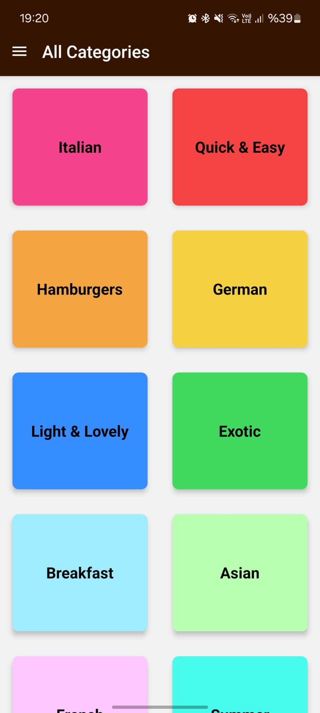
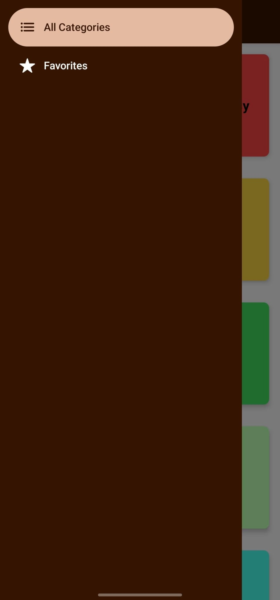
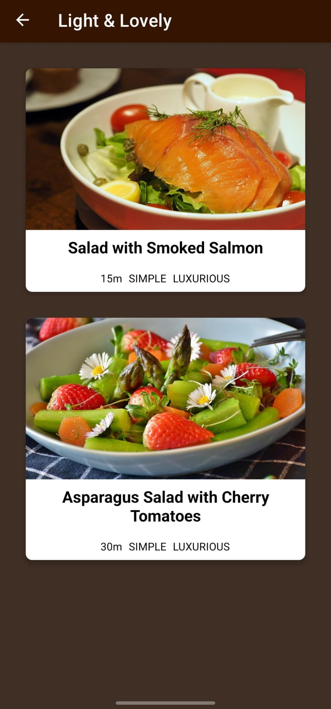
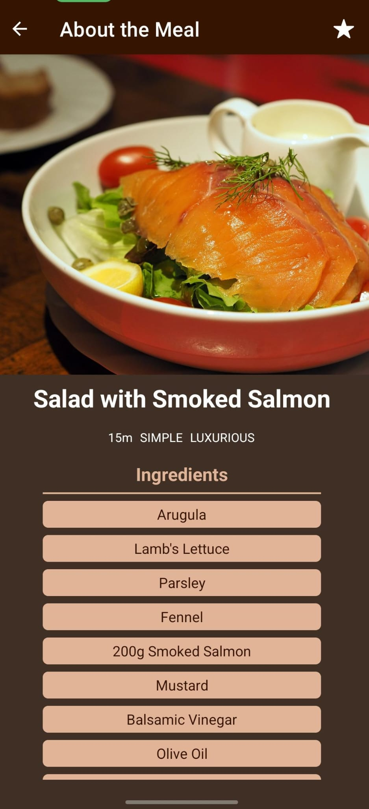
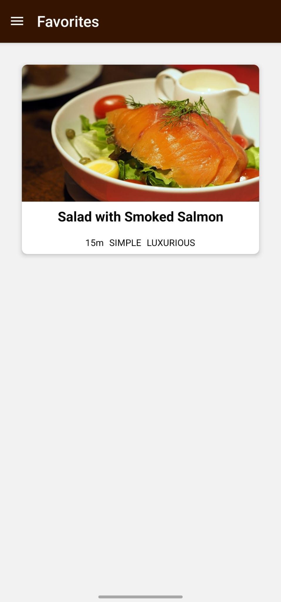

# 🍲 Meals App

A multi-screen mobile application built with **React Native** that allows users to browse meal categories, view recipes details, and manage their favorite meals. This project focuses on advanced navigation flows and demonstrates two different approaches to **Global State Management** (Context API & Redux Toolkit) within the same environment.

## 🌟 Features

1.  **Navigation Flow:** Seamless transition between categories and meal details using **Stack Navigation**.
2.  **Drawer Menu:** Dedicated access to the "Favorites" screen via **Drawer Navigation**.
3.  **State Management:** Users can mark meals as favorites. The app explores both **Context API** and **Redux Toolkit** to handle this global state.
4.  **Dynamic Content:** Renders meal items with complexity, affordability, and duration details.

## 📸 Screenshots

<div style="display: flex; flex-wrap: wrap; justify-content: center; gap: 10px;">
  
  
  
  
  
</div>

## 🛠 Tech Stack

- **React Native**
- **Expo**
- **React Navigation** (Native Stack & Drawer)
- **Redux Toolkit** (State Management)
- **Context API** (State Management - Alternative Implementation)
- **Javascript (ES6+)**

## 🚀 Installation

To run this project locally, follow these steps:

1.  **Clone the repo:**

2.  **Install dependencies:**

    ```bash
    npm install
    ```

3.  **Run the app:**
    ```bash
    npx expo start
    ```

## 📂 Project Structure

- `App.js`: Main entry point setting up Navigation and State Providers.
- `screens/`: Contains Categories, MealsOverview, MealDetail, and Favorites screens.
- `components/`: Reusable UI components like MealItem, CategoryGridTile, and IconButton.
- `store/`: Contains both Redux slices and Context logic for comparison.

---

_Developed to master React Navigation patterns and compare State Management libraries in React Native._
