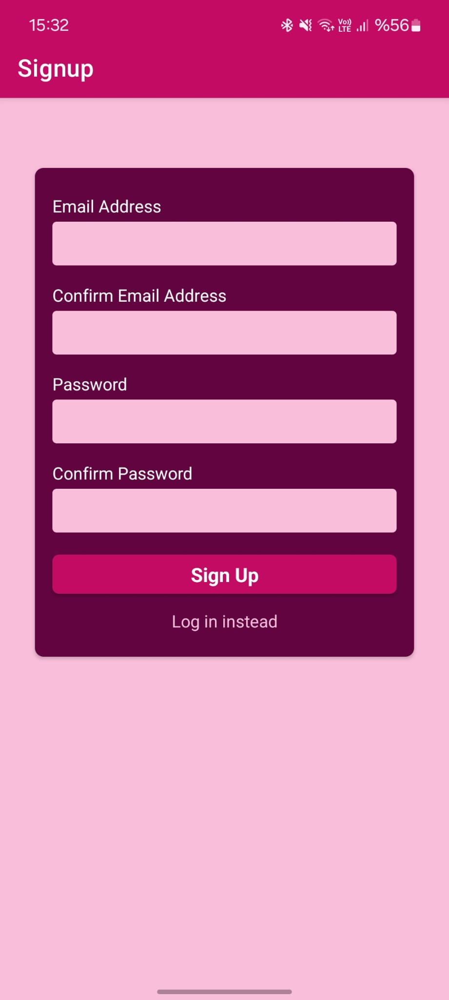

# 🔐 React Native Auth Starter

This project demonstrates a robust authentication flow using **React Native**, **Expo**, and **Firebase**. It covers essential security features including user signup, login, token management, and protected routes.

## 🌟 Key Features

1. **Secure Authentication:** Full implementation of Signup and Login logic using **Firebase Auth (REST API)**.
2. **State Management:** Centralized auth state handling via **React Context API** to manage user sessions app-wide.
3. **Persistent Sessions:** Uses **AsyncStorage** to store authentication tokens locally, keeping users logged in even after restarting the app.
4. **Protected Routes:** Navigation logic that prevents unauthorized access to the "Welcome" screen.

## 📸 Screenshots

<div style="display: flex; flex-wrap: wrap; justify-content: center; gap: 10px;">
  
  
  
</div>

## 🛠 Tech Stack

- **Core:** React Native, Expo
- **Navigation:** React Navigation (Native Stack)
- **State Management:** Context API
- **Networking:** Axios
- **Storage:** AsyncStorage
- **Backend:** Firebase (Auth & Realtime DB)

## 🚀 Installation

To run this project locally:

1. **Clone the repository**
1. **Install dependencies:**
   ```bash
   npm install
   ```
1. **Configure Firebase:**
   - Create a .env file (or update utils/http.js directly) with your Firebase API Key.
1. **Run the app:**
   ```bash
   npx expo start
   ```
